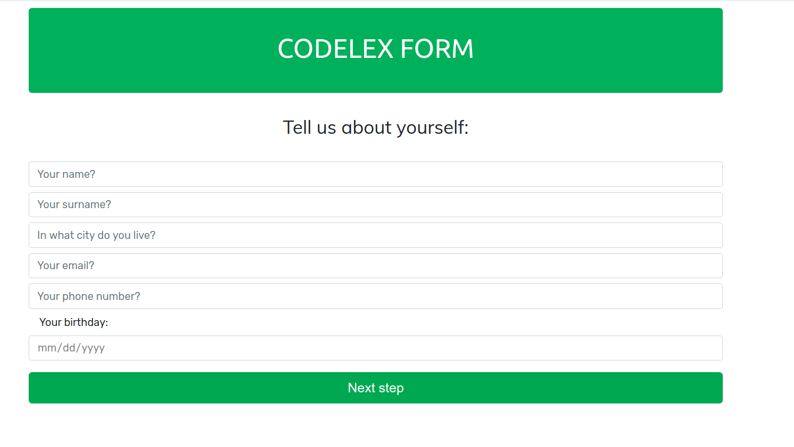
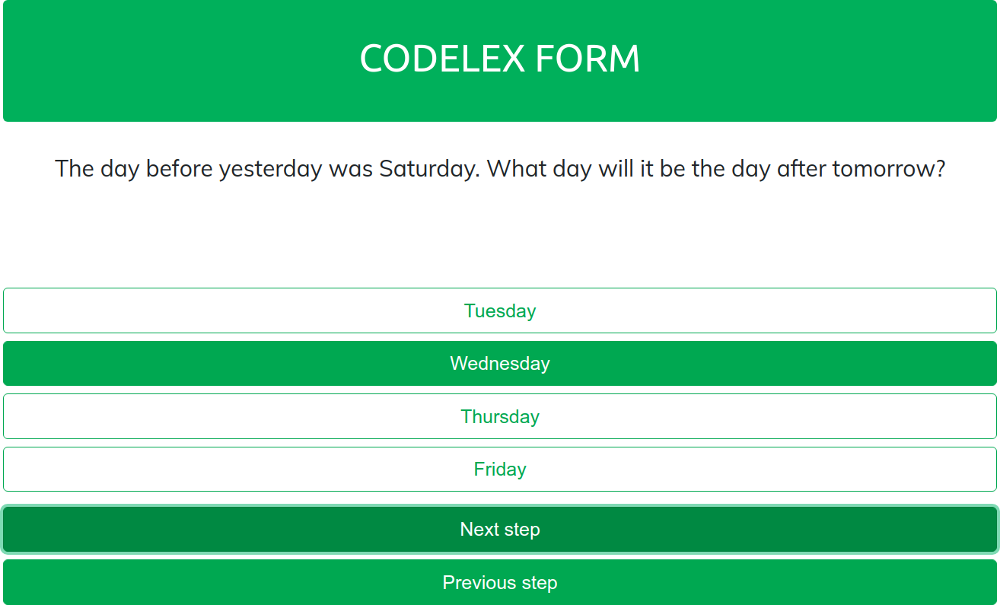

# Application form

Simple dynamic frontend application form made with HTML/CSS/VueJS without any data submitting backend.

## Form`s structure

Form consists of:

- personal details (name, surname, phone number, birthdate, etc.);
- some questions, for example - why do you want to learn coding etc.;
- few logical questions;
- few quiz type questions where question is about coding and there are few answers given;
- at the end there is notification that application is now waiting an approval;

Each step is being validated.

### My Linkedin
- https://www.linkedin.com/in/jurgis-veldre/

- couple screenshots:

